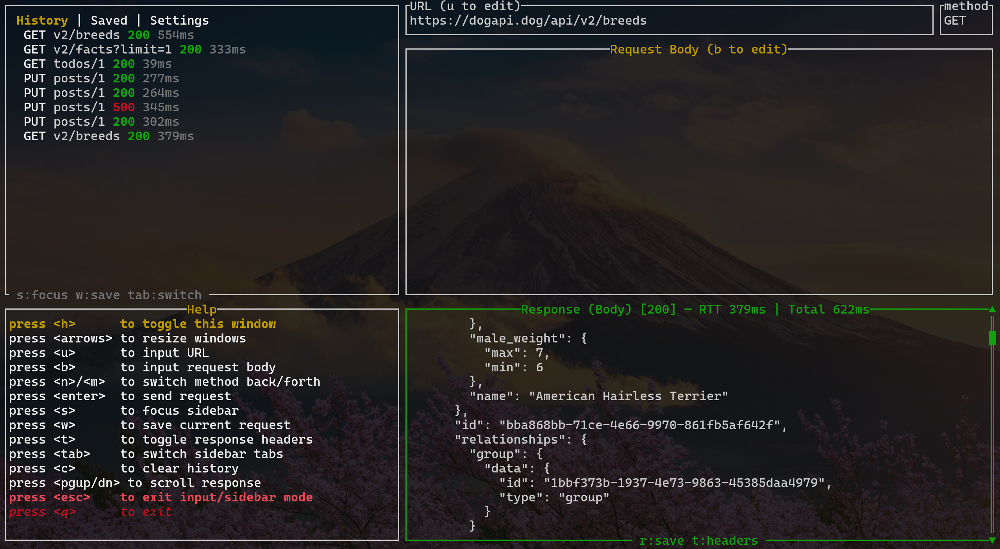

# curlrs

Postman in the terminal. Built with Rust.



## What it does

- Fire HTTP requests (GET, POST, PUT, PATCH, DELETE)
- Edit URL and body inline, see responses with JSON pretty-print
- Request history — browse, preview, and reload past requests
- Save requests for later, persisted to `curlrsdb.json`
- Export responses as JSON files
- Resize everything, scroll responses, it just works

## Install

Grab a binary from [releases](https://github.com/mamukinto/curlrs/releases) or build from source:

```
cargo install --path .
```

## Keys

| Key | What it does |
|-----|-------------|
| `u` | Edit URL |
| `b` | Edit request body |
| `m` / `n` | Cycle method forward/back |
| `Enter` | Send request |
| `s` | Focus sidebar |
| `w` | Save current request |
| `r` | Save response to file |
| `Tab` / `Shift+Tab` | Switch tabs |
| `arrows` | Resize panes |
| `PgUp/PgDn` | Scroll response |
| `c` | Clear history |
| `h` | Toggle help |
| `Esc` | Exit input/sidebar |
| `q` | Quit |

When sidebar is focused: `Up/Down` to navigate, `Enter` to load, `d` to delete.

## Stack

Rust + [ratatui](https://github.com/ratatui/ratatui) + [reqwest](https://github.com/seanmonstar/reqwest) + [crossterm](https://github.com/crossterm-rs/crossterm) + tokio
